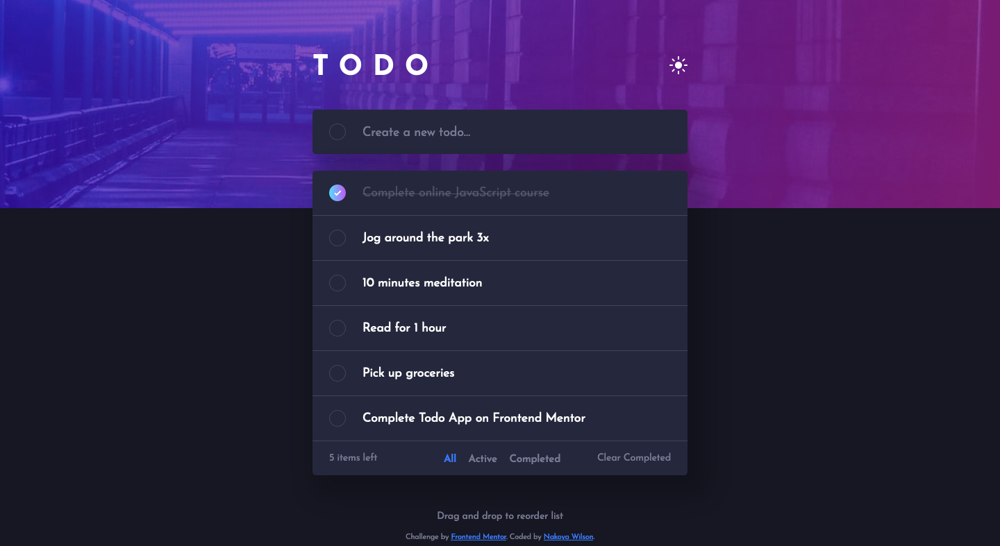

# Frontend Mentor - Todo app solution

This is a solution to the [Todo app challenge on Frontend Mentor](https://www.frontendmentor.io/challenges/todo-app-Su1_KokOW). Frontend Mentor challenges help you improve your coding skills by building realistic projects.

## Table of contents

- [Overview](#overview)
  - [The challenge](#the-challenge)
  - [Screenshot](#screenshot)
  - [Links](#links)
- [My process](#my-process)
  - [Built with](#built-with)
  - [Useful resources](#useful-resources)
- [Author](#author)

## Overview

### The challenge

Users should be able to:

- View the optimal layout for the app depending on their device's screen size
- See hover states for all interactive elements on the page
- Add new todos to the list
- Mark todos as complete
- Delete todos from the list
- Filter by all/active/complete todos
- Clear all completed todos
- Toggle light and dark mode
- **Bonus**: Drag and drop to reorder items on the list

### Screenshot

### Links

- Solution URL: [https://github.com/nakoyawilson/frontend-mentor-todo-app](https://github.com/nakoyawilson/frontend-mentor-todo-app)
- Live Site URL: [https://nakoyawilson.github.io/frontend-mentor-todo-app/](https://nakoyawilson.github.io/frontend-mentor-todo-app/)

## My process

### Built with

- HTML
- CSS
- [React](https://reactjs.org/)
- [react-beautiful-dnd](https://github.com/atlassian/react-beautiful-dnd)

### Useful resources

- [Create React App - Deployment](https://create-react-app.dev/docs/deployment/#github-pages) - This was helpful with learning how to deploy React apps on github pages.
- [How to resolve "Warning: Invalid DOM property `fill-rule`. Did you mean `fillRule`?" on Twilio Flex - Stack Overflow](https://stackoverflow.com/questions/54314284/how-to-resolve-warning-invalid-dom-property-fill-rule-did-you-mean-fillrul)
- [How can I align one item right with flexbox? - Stack Overflow](https://stackoverflow.com/questions/35269947/how-can-i-align-one-item-right-with-flexbox)
- [How do I store an array in localStorage?](https://stackoverflow.com/questions/3357553/how-do-i-store-an-array-in-localstorage)

## Author

- Website - [Nakoya Wilson](https://nakoyawilson.netlify.app/)
- Frontend Mentor - [@nakoyawilson](https://www.frontendmentor.io/profile/nakoyawilson)
- Twitter - [@nakoyawilson](https://twitter.com/nakoyawilson)
- LinkedIn - [@nakoyawilson](https://www.linkedin.com/in/nakoyawilson/)
